# The Same Origin Policy

## Introduction

The same-origin policy (SOP) is an important part of the security
mechanism of every modern browser. It controls when scripts running in
a browser can communicate with one another (roughly, when they
originate from the same website). First introduced in Netscape
Navigator, the SOP now plays a critical role in the security of web
applications; without it, it would be far easier for a malicious
hacker to peruse your private photos on Facebook, read your email, or
empty your bank account.

But the SOP is far from perfect. At times, it is too restrictive;
there are cases (such as mashups) in which scripts from different
origins should be able to share a resource but cannot. At other times
it is not restrictive enough, leaving corner cases that can be
exploited using common attacks such as cross-site request forgery.
Furthermore, the design of the SOP has evolved organically over the
years and puzzles many developers.

The goal of this chapter is to capture the essence of
this important -- yet often misunderstood -- feature. In particular, we
will attempt to answer the following questions:

* Why is the SOP necessary? What are the types of security violations that it prevents?
* How is the behavior of a web application affected by the SOP?
* What are different mechanisms for bypassing the SOP? 
* How secure are these mechanisms? What are potential security issues that they introduce?

Covering the SOP in its entirety is a daunting task, given the
complexity of the parts that are involved -- web servers, browsers,
the HTTP protocol, HTML documents, client-side scripts, and so on. We
would likely get bogged down by the gritty details of all these parts
(and consume our 500 lines before even reaching SOP!). But how can we
hope to be precise without representing crucial details?

## Modeling with Alloy

This chapter is somewhat different from others in this book. Instead
of building a working implementation, we will construct an executable
_model_ that serves as a simple yet precise description of the
SOP. Like an implementation, the model can be executed to explore
dynamic behaviors of the system; but unlike an implementation, the
model omits low-level details that may get in the way of understanding
the essential concepts.

The approach we take might be called “agile modeling” because of its
similarities to agile programming. We work incrementally, assembling
the model bit by bit. Our evolving model is at every point something
that can be executed. We formulate and run tests as we go, so that by
the end we have not only the model itself but also a collection of
_properties_ that it satisfies.

To construct this model, we use _Alloy_, a language for modeling and
analyzing software design. An Alloy model cannot be executed in the
traditional sense of program execution. Instead, a model can be (1)
_simulated_ to produce an _instance_, which represents a valid
scenario or configuration of a system, and (2) _checked_ to see
whether the model satisfies a desired property.

Despite above similarities, agile modeling differs from agile
programming in one key respect. Although we'll be running tests, we
actually won't be writing any. Alloy's analyzer generates test cases
automatically, and all that needs to be provided is the property to be
checked. Needless to say, this saves a lot of trouble (and text). The
analyzer actually executes all possible test cases up to a certain
size (called a _scope_); this typically means generating all starting
states with at most some number of objects, and then choosing
operations and arguments to apply up to some number of steps. Because
so many tests are executed (typically billions), and because all
possible configurations that a state can take are covered (albeit
within the scope), this analysis tends to expose bugs more effectively
than conventional testing (and is sometimes described not as "testing"
but as "bounded verification").

### Simplifications

Because the SOP operates in the context of browsers, servers, the HTTP
protocol, and so on, a complete description would be overwhelming. So
our model (like all models) abstracts away irrelevant aspects, such as
how network packets are structured and routed. But it also simplifies
some relevant aspects, which means that the model cannot fully account
for all possible security vulnerabilities.

For example, we treat HTTP requests like remote procedure calls,
ignoring the fact that responses to requests might come out of
order. We also assume that DNS (the domain name service) is static, so
we cannot consider attacks in which a DNS binding changes during an
interaction. In principle, though, it would be possible to extend our
model to cover all these aspects, although it's in the very nature of
security analysis that no model (even if it represents the entire
codebase) can be guaranteed complete.

## Roadmap

Here is the order in which we will proceed with our model of the
SOP. We will begin by building models of three key components that we
need in order for us to talk about the SOP: the HTTP protocol, the
browser, and client-side scripting. We will build on top of these
basic models to define what it means for a web application to be
_secure_, and then introduce the SOP as a mechanism that attempts to
achieve the required security properties.

We will then see that the SOP can be sometimes too restrictive,
getting in the way of a web application's proper functioning.  So we
introduce four different techniques that are commonly used to bypass
the restrictions that are imposed by the policy.

Feel free to explore the sections in any order you'd like. If you are
new to Alloy, we recommend starting with the first three sections
(HTTP, Browser, and Script), as they introduce some of the basic
concepts of the modeling language. While you are making your way
through the chapter, we also encourage you to play with the models in
the Alloy Analyzer; run them, explore the generated scenarios, and try
making modifications and seeing their effects. The tool is freely
available for download (http://alloy.mit.edu).

## Model of the Web

### HTTP Protocol

The first step in building an Alloy model is to declare some sets of
objects. Let's start with resources:

```alloy
sig Resource {}
```

The keyword “sig” identifies this as an Alloy signature
declaration. This introduces a set of resource objects; think of
these, just like the objects of a class with no instance variables, as
blobs that have identity but no content. When the analysis runs, this
set will be determined, just as a class in an object-oriented language
comes to denote a set of objects when the program executes.

Resources are named by URLs (*uniform resource locators*):

```alloy
sig Url {
  protocol: Protocol,
  host: Domain,
  port: lone Port,
  path: Path
}
sig Protocol, Domain, Port, Path {}
```

Here we have five signature declarations, introducing a set of URLs
and four additional sets for each of the basic kinds of objects they
comprise. Within the URL declaration, we have four fields. Fields are
like instance variables in a class; if `u` is a URL, for example, then
`u.protocol` would represent the protocol of that URL (just like dot
in Java). But in fact, as we'll see later, these fields are
relations. You can think of each one as if it were a two-column
database table. Thus `protocol` is a table with the first column
containing URLs and the second column containing protocols. And the
innocuous looking dot operator is in fact a rather general kind of
relational join, so that you could also write `protocol.p` for all the
URLs with a protocol `p` -- but more on that later.

Note that domains and paths, unlike URLs, are treated as if they have
no structure -- a simplification. The keyword `lone` (which can be
read "less than or equal to one") says that each URL has at most one
port. The path is the string that follows the host name in the URL,
and which (for a simple static server) corresponds to the file path of
the resource; we're assuming that it's always present, but can be an
empty path.

Let us introduce clients and servers, each of which contains a mapping
from paths to resources:

```alloy
abstract sig Endpoint {}
abstract sig Client extends Endpoint {}
abstract sig Server extends Endpoint {
  resources: Path -> lone Resource
}
```

The `extends` keyword introduces a subset, so the set `Client` of all
clients, for example, is a subset of the set `Endpoint` of all
endpoints. Extensions are disjoint, so no endpoint is both a client
and a server. The `abstract` keyword says that all extensions of a
signature exhaust it, so its occurrence in the declaration of
`Endpoint`, for example, says that every endpoint must belong to one
of the subsets (at this point, `Client` and `Server`). For a server
`s`, the expression `s.resources` will denote a map from paths to
resources (hence the arrow in the declaration). Recall that each field
is actually a relation that includes the owning signature as a first
column, so this field represents a three-column relation on `Server`,
`Path` and `Resource`.

To map a URL to a server, we introduce a set `Dns` of domain name
servers, each with a mapping from domains to servers:

```alloy
one sig Dns {
  map: Domain -> Server
}
```

The keyword `one` in the signature declaration means that (for
simplicity) we're going to assume exactly one domain name server, and
there will be a single DNS mapping, given by the expression `Dns.map`.
Again, as with the serving resources, this could be dynamic (and in
fact there are known security attacks that rely on changing DNS
bindings during an interaction) but we're simplifying.

In order to model HTTP requests, we also need the concept of
_cookies_, so let's declare them:

```alloy
sig Cookie {
  domains: set Domain
}
```

Each cookie is scoped with a set of domains; this captures the fact
that a cookie can apply to "*.mit.edu", which would include all
domains with the suffix "mit.edu".

Finally, we can put this all together to construct a model of HTTP
requests:

```alloy
abstract sig HttpRequest extends Call {
  url: Url,
  sentCookies: set Cookie,
  body: lone Resource,
  receivedCookies: set Cookie,
  response: lone Resource,
}{
  from in Client
  to in Dns.map[url.host]
}
```

We're modeling an HTTP request and response in a single object; the
`url`, `sentCookies` and `body` are sent by the client, and the
`receivedCookies` and `response` are sent back by the server.

When writing the `HttpRequest` signature, we found that it contained
generic features of calls, namely that they are from and to particular
things. So we actually wrote a little Alloy module that declares the
`Call` signature, and to use it here we need to import it:

```alloy
open call[Endpoint]
```

It's a polymorphic module, so it's instantiated with `Endpoint`, the
set of things calls are from and to. (The module appears in full in
the Appendix.)

Following the field declarations in `HttpRequest` is a collection of
constraints. Each of these constraints applies to all members of the
set of HTTP requests. The constraints say that (1) each request comes
from a client, and (2) each request is sent to one of the servers
specified by the URL host under the DNS mapping.

One of the prominent features of Alloy is that a model, no matter how
simple or detailed, can be executed at any time to generate sample
system instances. Let's use the `run` command to ask the Alloy
Analyzer to execute the HTTP model that we have so far:

```alloy
run {} for 3	-- generate an instance with up to 3 objects of every signature type
```

As soon as the analyzer finds a possible instance of the system, it
displays it graphically, like this:


This instance shows a client (represented by node `Client`) sending an
`HttpRequest` to `Server`, which, in response, returns a resource
object and instructs the client to store `Cookie` at `Domain`.

Even though this is a tiny instance with seemingly few details, it
signals a flaw in our model. Note that the resource returned from the
request (`Resource1`) does not exist in the server! We neglected to
specify an obvious fact about the server; namely, that every response
to a request is a resource that the server stores. We can go back to
our definition of `HttpRequest` and append the following constraint:

```alloy
abstract sig HttpRequest extends Call { ... }{
  ...
  response = to.resources[url.path]
}
```

Rerunning produces now instances without the flaw.

Instead of generating sample instances, we can ask the analyzer to
*check* whether the model satisfies a property. For example, one
property we might want is that when a client sends the same request
multiple times, it always receives the same response back:

```alloy
check { all r1, r2: HttpRequest | r1.url = r2.url implies r1.response = r2.response } for 3 
```

Given this `check` command, the analyzer explores every possible
behavior of the system (up to the specified bound), and when it find
one that violates the property, displays that instance as a
*counterexample*:

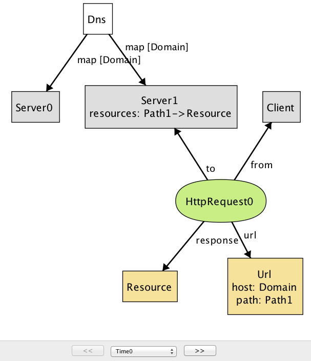
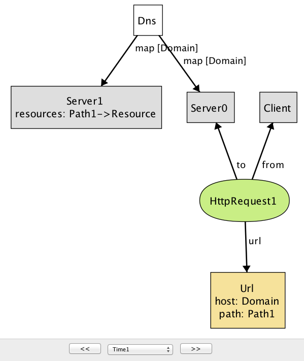

This counterexample again shows an HTTP request being made by a
client, but with two different servers. (In the Alloy visualizer,
objects of the same type are distinguished by appending numeric
suffixes to their names; if there is only one object of a given type,
no suffix is added. Every name that appears in a snapshot diagram is
the name of an object. So -- perhaps confusingly at first sight -- the
names Domain, Path, Resource, Url all refer to individual objects, not
to types!)

Note that while the DNS server maps `Domain` to both `Server0` and
`Server1` (in reality, this is a common practice for load balancing),
only `Server1` maps `Path` to a resource object, causing
`HttpRequest1` to result in empty response: another error in our
model! To fix this, we add an Alloy *fact* recording the assumption
that any two servers to which DNS maps a single host provide the same
set of resources:

```alloy
fact ServerAssumption {
  all s1, s2: Server | (some Dns.map.s1 & Dns.map.s2) implies s1.resources = s2.resources
}
```

When we re-run the `check` command after adding this fact, the
analyzer no longer reports any counterexamples for the property. This
doesn't mean the property has been proven to be true, since there
might be a counterexample in a larger scope. But it is unlikely that
the property is false, since the analyzer has tested all possible
instances involving 3 objects of each type. In this scope, the `map`
field alone (representing the DNS mapping) has 512 possible values.

### Browser

Let's introduce browsers:

```alloy
sig Browser extends Client {
  documents: Document -> Time,
  cookies: Cookie -> Time,
}
```

This is our first example of a signature with *dynamic fields*. Alloy
has no built-in notions of time or behavior, which means that a
variety of idioms can be used. In this model, we're using a common
idiom in which you introduce a notion of `Time`, and attach it as a
final column for every time-varying field. For example, expression
`b.cookes.t` represents the set of cookies that are stored in browser
`b` at particular time `t`. Likewise, the `documents` field associates
a set of documents with each browser at a given time (for more details
about how we model the dynamic behavior, see the Appendix).

Documents are created from a response to an HTTP request. They can
also be destroyed if, for example, the user closes a tab or the
browser, but we leave this out of the model. A document has a URL
(the one from which the document was originated), some content (the
DOM) and a domain:

```alloy
sig Document {
  src: Url,
  content: Resource -> Time,
  domain: Domain -> Time
}
```

The inclusion of the `Time` column for the latter two fields tells us
that they can vary over time, and its omission for the first (`src`,
representing the source URL of the document) indicates that the source
URL is fixed.

To model the effect of an HTTP request on a browser, we introduce a
new signature, since not all HTTP requests will originate at the level
of the browser; the rest will come from scripts.

```alloy
sig BrowserHttpRequest extends HttpRequest {
  doc: Document
}{
  -- the request comes from a browser
  from in Browser
  -- the cookies being sent exist in the browser at the time of the request
  sentCookies in from.cookies.start
  -- every cookie sent must be scoped to the url of the request
  all c: sentCookies | url.host in c.domains

  -- a new document is created to display the content of the response
  documents.end = documents.start + from -> doc
  -- the new document has the response as its contents
  content.end = content.start ++ doc -> response
  -- the new document has the host of the url as its domain
  domain.end = domain.start ++ doc -> url.host
  -- the document's source field is the url of the request
  doc.src = url

  -- new cookies are stored by the browser
  cookies.end = cookies.start + from -> sentCookies
}
```

This kind of request has one new field, `doc`, representing the
document created in the browser from the resource returned by the
request. As with `HttpRequest`, the behavior is described as a
collection of constraints. Some of these say when the call can happen:
for example, that the call has to come from a browser. Some constrain
the arguments of the call: for example, that the cookies must be
scoped appropriately. And some constrain the effect, using a common
idiom that relates the value of a relation after the call to its value
before.

For example, to understand the constraint `documents.end =
documents.start + from -> doc` remember that `documents` is a 3-column
relation on browsers, documents and times. The fields `start` and
`end` come from the declaration of `Call` (which we haven't seen, but
is included in the listing at the end), and represent the times at the
beginning and end of the call. The expression `documents.end` gives
the mapping from browsers to documents when the call has ended. So
this constraint says that after the call, the mapping is the same,
except for a new entry in the table mapping `from` to `doc`.

Some constraints use the `++` relational override operator: `e1 ++ e2`
contains all tuples of `e2`, and additionally, any tuples of `e1`
whose first element is not the first element of a tuple in `e2`. For
example, the constraint `content.end = content.start ++ doc ->
response` says that after the call, the `content` mapping will be
updated to map `doc` to `response` (clobbering any previous mapping of
`doc`).  If we were to use the union operator `+` instead, then the
same document might (incorrectly) be mapped in the after state to
multiple resources.

### Script

Next, we will build on the HTTP and browser models to introduce *client-side scripts*, which represent pieces of code (typically in JavaScript) executing inside a browser document (`context`). 

```alloy
sig Script extends Client { context: Document }
```

A script is a dynamic entity that can perform two different kinds of
action: (1) it can make HTTP requests (i.e., Ajax requests) and (2) it
can perform browser operations to manipulate the content and
properties of a document. The flexibility of client-side scripts is
one of the main catalysts behind the rapid development of Web 2.0, but
is also the reason why the SOP was created in the first place. Without
the SOP, scripts would be able to send arbitrary requests to servers,
or freely modify documents inside the browser -- which would be bad
news if one or more of the scripts turned out to be malicious!

A script can communicate to a server by sending an `XmlHttpRequest`:

```alloy
sig XmlHttpRequest extends HttpRequest {}{
  from in Script
  noBrowserChange[start, end] and noDocumentChange[start, end]
}
```

An `XmlHttpRequest` can be used by a script to send/receive resources
to/from a server, but unlike `BrowserHttpRequest`, it does not
immediately result in creation of a new page or other changes to the
browser and its documents. To say that a call does not modify these
aspects of the system, we define predicates `noBrowserChange` and
`noDocumentChange`:

```alloy
pred noBrowserChange[start, end: Time] {
  documents.end = documents.start and cookies.end = cookies.start  
}
pred noDocumentChange[start, end: Time] {
  content.end = content.start and domain.end = domain.start  
}
```

What kind of operations can a script perform on documents? First, we
introduce a generic notion of *browser operations* to represent a set
of browser API functions that can be invoked by a script:

```alloy
abstract sig BrowserOp extends Call { doc: Document }{
  from in Script and to in Browser
  doc + from.context in to.documents.start
  noBrowserChange[start, end]
}
```

Field `doc` refers to the document that will be accessed or
manipulated by this call. The second constraint in the signature facts
says that both `doc` and the document in which the script executes
(`from.context`) must be documents that currently exist inside the
browser. Finally, a `BrowserOp` may modify the state of a document,
but not the set of documents or cookies that are stored in the
browser. (Actually, cookies can be associated with a document and
modified using a browser API, but we omit this detail for now.)

A script can read from and write to various parts of a document
(usually called DOM elements). In a typical browser, there are a large
number of API functions for accessing the DOM (e.g.,
`document.getElementById`), but enumerating all of them is not
important for our purpose. Instead, we will simply group them into two
kinds -- `ReadDom` and `WriteDom` -- and model modifications as
wholesale replacements of the entire document:

```alloy
sig ReadDom extends BrowserOp { result: Resource }{
  result = doc.content.start
  noDocumentChange[start, end]
}
sig WriteDom extends BrowserOp { newDom: Resource }{
  content.end = content.start ++ doc -> newDom
  domain.end = domain.start
}
```

`ReadDom` returns the content the target document, but does not modify
it; `WriteDom`, on the other hand, sets the new content of the target
document to `new_dom`.

In addition, a script can modify various properties of a document,
such as its width, height, domain, and title. For our discussion of
the SOP, we are only interested in the domain property, which we will
introduce in a later section.

## Example Applications

As we've seen earlier, given a `run` or `check` command, the Alloy
Analyzer generates a scenario (if it exists) that is consistent with
the description of the system in the model. By default, the analyzer
arbitrarily picks _any_ one of the possible system scenarios (up to
the specified bound), and assign numeric identifiers to signature
instances (`Server0`, `Browser1`, etc.,) in the scenario.

Sometimes, we may wish to analyze the behavior of a _particular_ web
application, instead of exploring scenarios with a random
configuration of servers and clients. For example, imagine that we
wish to build an email application (like Gmail) that runs inside a
browser.  In addition to providing basic email features, our
application might display a banner from a third-party advertisement
service, which is controlled by a potentially malicious actor.

In Alloy, the keywords `one sig` introduce a _singleton_ signature
containing exactly one object; we saw an example above with
`Dns`. This syntax can be used to specify concrete atoms. For example,
to say that there is one inbox page and one ad banner (each of which
is a document) we can write:

```alloy
one sig InboxPage, AdBanner extends Document {}
```

With this declaration, every scenario that Alloy generates will
contain at least these two `Document` objects.

Likewise, we can specify particular servers, domains and so on, with a
constraint (which we've called `Configuration`) to specify the
relationships between them:

```alloy
one sig EmailServer, EvilServer extends Server {}
one sig EvilScript extends Script {}
one sig EmailDomain, EvilDomain extends Domain {}
fact Configuration {
  EvilScript.context = AdBanner
  InboxPage.domain.first = EmailDomain
  AdBanner.domain.first = EvilDomain  
  Dns.map = EmailDomain -> EmailServer + EvilDomain -> EvilServer
}
```

For example, the last constraint in the fact specifies how the DNS is
configured to map domain names for the two servers in our
system. Without this constraint, the Alloy Analyzer may generate
scenarios where `EmailDomain` is mapped to `EvilServer`, which are not
of interest to us (in practice, such a mapping may be possible due to
an attack called _DNS spoofing_, but we will rule it out from our
model since it lies outside the class of attacks that the SOP is
designed to prevent).

Let us introduce two additional applications: an online calendar and a
blog site:

```alloy
one sig CalendarServer, BlogServer extends Document {} 
one sig CalendarDomain, BlogDomain extends Domain {}
```

We should update the constraint about the DNS mapping above to
incorporate the domain names for these two servers:

```alloy
fact Configuration {
  ...
  Dns.map = EmailDomain -> EmailServer + EvilDomain -> EvilServer + 
            CalendarDomain -> CalenderServer + BlogDomain -> BlogServer  
}
```

In addition, let us say that that the email, blog, and calendar
applications are all developed by a single organization, and thus,
share the same base domain name. Conceptually, we can think of
`EmailServer` and `CalendarServer` having domain names
`email.example.com` and `calendar.example.com`, thus sharing
`example.com` as the common superdomain. In our model, this can be
represented by introducing a domain name that _subsumes_ others:

```alloy 
one sig ExampleDomain extends Domain {}{
  subsumes = EmailDomain + EvilDomain + CalendarDomain + this
}   
```

Note that `this` is included as a member of `subsumes`, since every
domain name subsumes itself.

There are other details about these applications that we omit here
(see example.als for the full model). But we will revisit these
applications as our running example throughout the remainder of this
chapter.

## Security Properties

Before we get to the SOP itself, there is an important question that we
have not discussed yet: What exactly do we mean when we say our system
is _secure_?

Not surprisingly, this is a tricky question to answer. For our purposes, we will
turn to two well-studied concepts in information
security -- _confidentiality_ and _integrity_. Both of these concepts talk
about how information should be allowed to pass through the 
various parts of the system. Roughly, _confidentiality_ means that a
critical piece of data should only be accessible to parts that are
deemed trusted, and _integrity_ means that trusted parts
only rely on data that have not been maliciously tampered with.

In order to specify these security properties more precisely, we first
need to define what it means for a piece of data to _flow_ from one
part of the system to another. In our model so far, we have described
interactions between two endpoints as being carried out through
_calls_; e.g., a browser interacts with a server by making HTTP
requests, and a script interacts with the browser by invoking browser
API operations. Intuitively, during each call, a piece of data may flow
from one endpoint to another as an _argument_ or _return value_ of the
call. To represent this, we introduce a notion of `DataflowCall` into the
model, and associate each call with a set of `args` and `returns` data
fields:

```alloy
sig Data in Resource + Cookie {}

sig DataflowCall in Call {
  args, returns: set Data,  -- arguments and return data of this call
}{
 this in HttpRequest implies
    args = this.sentCookies + this.body and
    returns = this.receivedCookies + this.response
 ...
}
```

For example, during each call of type `HttpRequest`, the client
transfers two arguments (`sentCookies` and `body`) to the server, and
in turn, receives two addition sets of data (`receivedCookies` and
`response`) as return values. 

More generally, arguments flow from the sender of the call to the
receiver, and return values flow from the receiver to the sender. This
means that the only way for an endpoint to access a new piece of data
is by receiving it as an argument of a call that the endpoint accepts,
or a return value of a call that the endpoint invokes. We introduce a
notion of `DataflowModule`, and assign field `accesses` to represent the
set of data elements that the module can access at each time step:

```alloy
sig DataflowModule in Endpoint {
  -- Set of data that this component initially owns
  accesses: Data -> Time
}{
  all d: Data, t: Time - first |
	 -- This endpoint can only access a piece of data "d" at time "t" only when
    d -> t in accesses implies
      -- (1) It already had access in the previous time step, or
      d -> t.prev in accesses or
      -- there is some call "c" that ended at "t" such that
      some c: Call & end.t |
        -- (2) the endpoint receives "c" that carries "d" as one of its arguments or
        c.to = this and d in c.args or
        -- (3) the endpoint sends "c" that returns "d" 
        c.from = this and d in c.returns 
}
```

We also need to restrict data elements that a module can provide as arguments or return values of a call. Otherwise, we may get weird scenarios where a module can make a call with an argument that it has no access to!

```alloy
sig DataflowCall in Call { ... } {
  -- (1) Any arguments must be accessible to the sender
  args in from.accesses.start
  -- (2) Any data returned from this call must be accessible to the receiver
  returns in to.accesses.start
}
```

Now that we have means to describe data flow between different parts
of the system, we are (almost) ready to state security properties that
we care about. But recall that confidentiality and integrity are
_context-dependent_ notions; these properties make sense only if we
can talk about some agents within the system as being trusted (or
malicious). Similarly, not all information is equally important: we
need to distinguish between data elements that we consider to be
critical or malicious (or neither):

```alloy
sig TrustedModule, MaliciousModule in DataflowModule {}
sig CriticalData, MaliciousData in Data {}
```

Then, the confidentiality property can be stated as an _assertion_ on
the flow of critical data into non-trusted parts of the system:

```alloy
// No malicious module should be able to access critical data
assert Confidentiality {
  no m: Module - TrustedModule, t: Time |
    some CriticalData & m.accesses.t 
}
```

The integrity property is the dual of confidentiality: 

```alloy
// No malicious data should ever flow into a trusted module
assert Integrity {
  no m: TrustedModule, t: Time | 
    some MaliciousData & m.accesses.t
}
```

When prompted with a `check` command, the Alloy Analyzer analyzes _all_ possible dataflow traces in the system and produces a counterexample (if one exists) that demonstrates how an assertion might be violated:

```
check Confidentiality for 5
```

For example, when checking the model of our example application against the confidentiality property, the analyzer generates the following scenario, which shows how `EvilScript` may access a piece of critical data (`MyInboxInfo`):

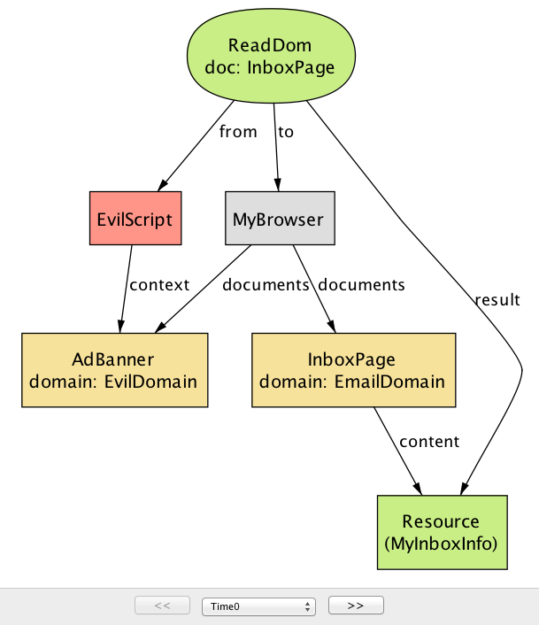 
 

This counterexample involves two steps. In the first step, `EvilScript`, executing inside `AdBanner` from `EvilDomain`, reads the content of `InboxPage`, which originates from `EmailDomain`. In the next step, `EvilScript` sends the same content (`MyInboxInfo`) to `EvilServer` by making an `XmlHtttpRequest` call. The core of the problem here is that a script executing under one domain is able to read the content of a document from another domain; as we will see in the next section, this is exactly one of the scenarios that the SOP is designed to prevent.

There may be multiple counterexamples to a single assertion. Consider the following scenario, which shows a different way in which the system may violate the confidentiality property:

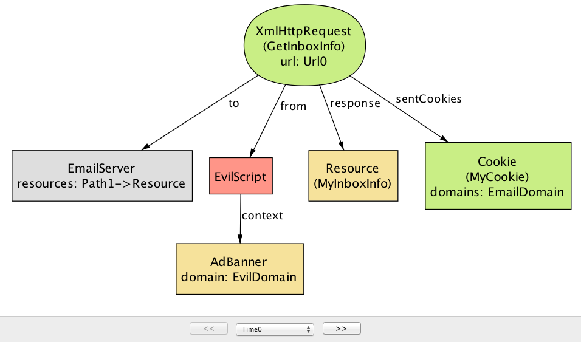 

In this scenario, instead of reading the content of the inbox page,
`EvilScript` directly makes a `GetInboxInfo` request to `EmailServer`.
Note that the request includes a cookie (`MyCookie`), which is scoped
to the same domain as the destination server. This is potentially
dangerous, because if the cookie is used to represent the user's
identity (e.g., a session cookie), `EvilScript` can effectively
pretend to be the user and trick the server into responding with the
user's private data (`MyInboxInfo`)! Here, the problem is again
related to the liberal ways in which a script may be used to access
information across different domains -- namely, that a script executing
under one domain is able to make an HTTP request to a server with a
different domain.

These two counterexamples tell us that extra measures are needed to
restrict the behavior of scripts, especially since some of those
scripts could be malicious. This is exactly where the SOP comes in.

## Same Origin Policy

Before we can state the SOP, the first thing we should do is to introduce the
notion of an origin, which is composed of a protocol, host, and optional port:

```alloy
sig Origin {
  protocol: Protocol,
  host: Domain,
  port: lone Port
}
```

We define a function that given a URL returns the corresponding origin:

```alloy
fun origin[u: Url] : Origin {
    {o: Origin | o.protocol = u.protocol and o.host = u.host and o.port = u.port }
}
```
The SOP itself has two parts, restricting the ability of a script to (1) make DOM API calls and (2) send HTTP requests. The first part of the policy states that a script can only read from and write to a document that comes from the same origin as the script:
```alloy
pred domSop { all c: ReadDom + WriteDom | origin[c.doc.src] = origin[c.from.context.src] }
```
An instance such as the first script scenario is not possible under `domSop`, since `Script` is not allowed to invoke `ReadDom` on a document from a different origin.

The second part of the policy says that a script cannot send an HTTP request to a server unless its context has the same origin as the target URL -- effectively preventing instances such as the second script scenario.
```alloy
pred xmlHttpReqSop { all x: XmlHttpRequest | origin[x.url] = origin[x.from.context.src] }
```
As we can see, the SOP is designed to prevent the two types of vulnerabilities that could arise from actions of a malicious script; without it, the web would be a much more dangerous place than it is today.

It turns out, however, that the SOP can be *too* restrictive. For
example, sometimes you *do* want to allow communication between two
documents of different origins. By the above definition of an origin,
a script from `foo.example.com` would not be able to read the content
of `bar.example.com`, or send a HTTP request to `www.example.com`,
because these are all considered distinct hosts.

In order to allow some form of cross-origin communication when
necessary, browsers implemented a variety of mechanisms for relaxing
the SOP. Some of these are more well-thought-out than others, and some
have serious flaws that, when badly used, can undermine the security
benefits of the SOP. In the following sections, we will describe the
most common of these mechanisms, and discuss their potential security
pitfalls.

## Techniques for Bypassing the SOP

The SOP is a classic example of the tension between functionality and security; we want to make sure our sites are secure, but the mechanism for ensuring security sometimes can get in the way. Indeed, when the SOP was initially introduced, developers ran into trouble building sites that made legitimate uses of cross-domain communication, e.g. for mashups.

In this section, we will discuss four techniques that have been devised and frequently used by web developers to bypass the restrictions imposed by the SOP: (1) The "document.domain" property relaxation; (2) JSONP; (3) PostMessage; and (4) CORS. These are useful tools, but if used without caution may make a web application vulnerable to exactly the kinds of attacks SOP was designed to thwart.

Each of these four techniques is surprisingly complex, and if described in full detail, would merit its own chapter. So here we just give a brief flavor of how they work, potential security problems that they introduce, and how to prevent these problems.

### Domain Property

The idea behind the domain property relaxation of the SOP, is to
give two pages of the same site permission to read and write each other's DOM by
setting the `document.domain` property to the same value -- thus bypassing the
SOP restriction on DOM access. So, for example,
a script in `foo.example.com` could read/write the DOM of `example.com` if both
scripts set the `document.domain` property to `example.com` (assuming both
source URLs have also the same protocol and port). 

We model the operation of setting the `document.domain` property by adding
a `SetDomain` browser operation:

```alloy
// Modify the document.domain property
sig SetDomain extends BrowserOp { newDomain: Domain }{
  doc = from.context
  domain.end = domain.start ++ doc -> newDomain
  -- no change to the content of the document
  content.end = content.start
}
```

The `newDomain` field represents the value to which the property should be set.
There's a caveat, though: scripts can only set the domain property to 
a right-hand, fully qualified fragment of its hostname.
(i.e., `foo.example.com` can set it to `example.com` but not to
 `google.com`). \*

(\* Wondering if it's possible to set the domain to just `com`? `foo.example.com` would
 be a subdomain of `com` after all, but browsers know that
 `com` is a top-level domain and disallow this.)

We add a `fact` to capture this rule:

```alloy
// Scripts can only set the domain property to only one that is a right-hand,
// fully-qualified fragment of its hostname
fact setDomainRule {
  all d: Document | d.src.host in (d.domain.Time).subsumes
}
```

If it weren't for this rule, any site could set the `document.domain`
property to any value, which means that, for example, a malicious site
could set the domain property to your bank domain, load your bank
account in an iframe, and (assuming the bank page has set its domain
property) read the DOM of your bank page!

Now we modify our original definition of the SOP for DOM accesses to
reflect the domain property relaxation. If two scripts set the
`document.domain` property to the same value, and they have the same
protocol and port, then these two scripts can interact with each other
(that is, read and write each other's DOM). They won't be allowed to
do so if only one of the scripts sets the property while the other one
doesn't, even if the resulting properties match.\*

(\* At first sight, it's strange that browsers distinguish whether the
property is explicitly set rather than just examining its
value. Without this, various bad things can happen. For example, a
site could be subject to a cross-site scripting attack from its
subdomains: `foo.example.com`, say, might set the `document.domain`
property to `example.com` and write to the parent domain's DOM, even
if the parent domain never set the property.)

```alloy
pred domSop {
  all op: ReadDom + WriteDom | 
    -- a script can access the DOM of a document with the same origin
    origin[op.doc.src] = origin[op.from.context.src] or
    -- the domain property of both script's context and target doc have been set...
    (op.doc + op.from.context in (op.prevs <: SetDomain).doc and
    -- ...and they have the same origin (with the domain property as host)
    origin[op.doc.src, op.doc.domain.(op.start)] =
    origin[op.from.context.src, op.from.context.domain.(op.start)])\*
}
```

(\* In these constraints, `op.start` is the start time of the read or write operation, so the expression `op.doc.domain.(op.start)`, for example, refers to the domain of the operation's document as it was _before_ the operation occurred.)

To illustrate the purpose of this relaxation, we can ask the analyzer to give us an instance where two documents that are from different origins nevertheless communicate with each other:

```alloy
// Can a script read or write the DOM of a document with another origin?
run { some c: ReadDom + WriteDom | origin[c.doc.src] != origin[c.from.context.src] }
```

The analyzer generates the following scenario, showing how two documents from distinct origins, `CalendarPage` and `InboxPage`, communicate by setting their domain properties to a common value (`ExampleDomain`):

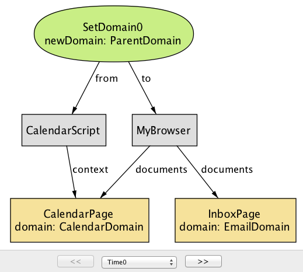
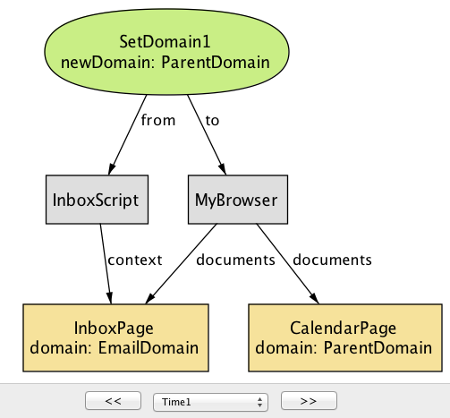
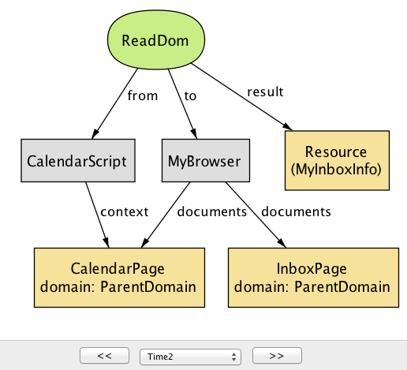

At the beginning of the scenario, `InboxPage` and `CalendarPage` have
domain properties with two distinct values (`EmailDomain` and
`ExampleDomain`, respectively), so the browser will prevent
them from accessing each other's DOM. The scripts running inside the
documents (`InboxScript` and
`CalendarScript`) each execute the `SetDomain` operation to modify their domain
properties to `ExampleDomain` (which is allowed because
`ExampleDomain` is a superdomain of the original domain). Having done this, 
they can now access each other's DOM
by executing `ReadDom` or `WriteDom` operations.

While this method of cross-origin communication may seem simple and
convenient, it is far from perfect.  First, this method is
not general enough. In particular, it may be used enable cross-origin
DOM access _only_ between documents that have a common superdomain,
meaning it cannot be used by applications from completely
different domains.

Second, using the domain property mechanism can put the entire site
at risk.  When you set the domain property of both "email.example.com"
and "calendar.example.com" to "example.com", you are allowing not only
these two pages to communicate between each other, but also _any_
other page that has "example.com" as a superdomain
(e.g. "blog.example.com"). This has significant security consequences;
for example, if "blog.example.com" has a cross-site scripting vulnerability, an
attacker can inject a malicious script into the blog page, modify its
domain property to "example.com", and then use the DOM API functions to
access the content of the other pages. 

When prompted to check the confidentiality property of the example
email application, the Alloy Analyzer generates the following
scenario, which demonstrates how a malicious script, running inside
`BlogPage`, may be able to read the content of the inbox page by
setting its domain property to `ExampleDomain`:

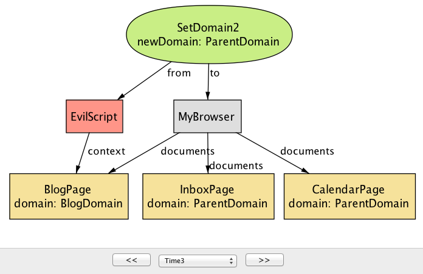
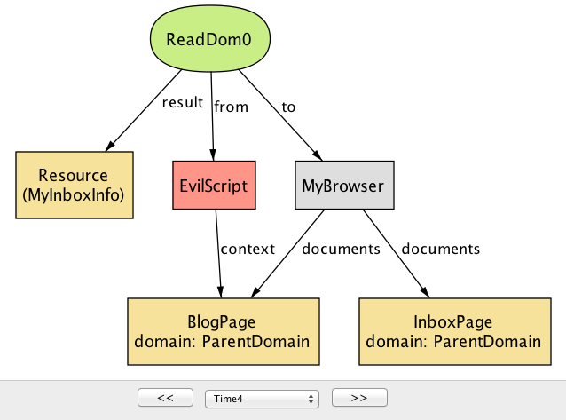

This attack points out one crucial weakness of the domain property
method for cross-origin communication: The security of an application
that uses this method is only as strong as the weakest link in all of
the pages that share the same base domain. We will shortly discuss
another method called PostMessage, which can be used for a more
general class of cross-origin communication while also being more
secure.

### JSON with Padding (JSONP)

Before the introduction of CORS (which we will discuss shortly), JSONP
was perhaps the most popular technique for bypassing the SOP
restriction on XMLHttpRequest, and still remains widely used
today. JSONP takes advantage of the fact that script inclusion tags in
HTML (i.e., `<script>`) are exempt from the SOP*; that is, you can
include a script from _any_ URL, and the browser readily executes it
in the current document:

(\* Without this exemption, it would not be possible to load JavaScript libraries, such as JQuery, from other domains.)

```html
<script src="http://www.example.com/myscript.js"></script>
```

A script tag can be used to obtain code, but how do we use it to
receive arbitrary _data_ (e.g., a JSON object) from a different
domain? The problem is that the browser expects the content of `src`
to be a piece of JavaScript code, and so simply having it point at a
data source (e.g., JSON or HTML file) results in a syntax error.

One workaround is to wrap the desired data inside a piece of string that the browser recognizes as valid JavaScript code; this string is sometimes called _padding_ (hence the name "JSON with padding"). This padding could be any arbitrary JavaScript code, but conventionally, it is the name of a callback function (already defined in the current document) that is to be executed on the response data:

```html
<script src="http://www.example.com/mydata?jsonp=processData"></script>
```

The server on `www.example.com` recognizes it as a JSONP request, and wraps the requested data inside the `jsonp` parameter:

```html
processData(mydata)
```

which is a valid JavaScript statement (namely, the application of function "processData" on value "mydata"), and is executed by the browser in the current document.

In our model, JSONP is modeled as a kind of HTTP request that includes
the identifier of a callback function in the field `padding`. After
receiving a JSONP request, the server returns a response that has the
requested resource (`payload`) wrapped inside the callback function
(`cb`).

```alloy
sig CallbackID {}  // identifier of a callback function
// Request sent as a result of <script> tag
sig JsonpRequest in BrowserHttpRequest {
  padding: CallbackID
}{
  response in JsonpResponse
}
sig JsonpResponse in Resource {
  cb: CallbackID,
  payload: Resource
}
```

When the browser receives the response, it executes the callback
function on the payload:

```alloy
sig JsonpCallback extends EventHandler {
  cb: CallbackID,
  payload: Resource
}{
  causedBy in JsonpRequest
  let resp = causedBy.response | 
    cb = resp.@cb and
    -- result of JSONP request is passed on as an argument to the callback
    payload = resp.@payload
}
```

Note that the callback function executed is the same as the one that's
included in the response (`cb = resp.@cb`), but _not_ necessarily the
same as `padding` in the original JSONP request. In other words, for
the JSONP communication to work, the server is responsible for
properly constructing a response that includes the original padding as
the callback function (i.e., ensure that `JsonRequest.padding =
JsonpResponse.cb`). In principle, the server can choose to include any
callback function (or any piece of JavaScript), including one that has nothing
to do with `padding` in the request. This highlights a potential
risk of JSONP: the server that accepts the JSONP requests must be
trustworthy and secure, because it has the
ability to execute any piece of JavaScript code in the client document.

Yet another risk with JSONP is its vulnerability to cross-site request
forgery (CSRF) attacks.  Consider the following scenario from our Alloy model. Suppose that the calendar application (`CalenderServer`) makes its resources available to third-party sites using a JSONP endpoint (`GetSchedule`). To restrict access to the resources, `CalendarServer` only sends back a response with the schedule for a user if the request contains a cookie that correctly identifies that user. 

Once a server provides an HTTP endpoint as a JSONP service, anyone can
make a JSONP request to it, including malicious sites. In this
scenario, the ad banner page from `EvilServer` includes a _script_ tag that causes a `GetSchedule` request, with a callback function called `Leak` as `padding`. Typically, the developer of `AdBanner` does not have direct access to the victim user's session cookie (`MyCookie`) for `CalendarServer`. However, because the JSONP request is being sent to `CalendarServer`, the browser automatically includes `MyCookie` as part of the request; `CalendarServer`, having received a JSONP request with `MyCookie`, will return the victim's resource (`MySchedule`) wrapped inside the padding `Leak`.


In the next step, the browser interprets the JSONP response as a call to `Leak(MySchedule)`. The rest of the attack is simple; `Leak` can simply be programmed to forward the input argument to `EvilServer`, allowing the attacker to access the victim's sensitive information.


### PostMessage

PostMessage is a new feature in HTML5 that allows scripts from two documents (of possibly different origins) to communicate with each other. It offers a more disciplined alternative to the method of setting the `domain` property, but brings its own security risks.

`PostMessage` is a browser API function that takes two arguments: (1) the data to be sent (`message`), and (2) the origin of the document receiving the message (`targetOrigin`):

```alloy
sig PostMessage extends BrowserOp {
  message: Resource,
  targetOrigin: Origin
}
```

To receive a message from another document, the receiving document  registers an event handler that is invoked by the browser as a consequence of a `PostMessage`:

```alloy
sig ReceiveMessage extends EventHandler {
  data: Resource,
  srcOrigin: Origin
}{
  causedBy in PostMessage
  -- "ReceiveMessage" event is sent to the script with the correct context
  origin[to.context.src] = causedBy.targetOrigin
  -- messages match
  data = causedBy.@message
  -- the origin of the sender script is provided as "srcOrigin" param 
  srcOrigin = origin[causedBy.@from.context.src]
}
```

The browser passes two parameters to `ReceiveMessage`: a resource (`data`) that corresponds to the message being sent, and the origin of the sender document (`srcOrigin`). The signature fact contains four constraints to ensure that each `ReceiveMessage` is well-formed with respect to its corresponding `PostMessage`. 

By default, the `PostMessage` mechanism does not restrict who is allowed to send PostMessage; in other words, any document can send a message to another document as long as the latter has registered a `ReceiveMessage` handler. It is the responsibility of the receiving document to _additionally_ check the `srcOrigin` parameter to ensure that the message is coming from a trustworthy document. 

Unfortunately, in practice, many sites omit this check, enabling a
malicious document to inject bad content as part of a `PostMessage`
[cite PostMessage study]. For example, in the following instance
generated from Alloy, `EvilScript`, running inside `AdBanner`, sends a
malicious `PostMessage` to a document with the target origin of
`EmailDomain`.

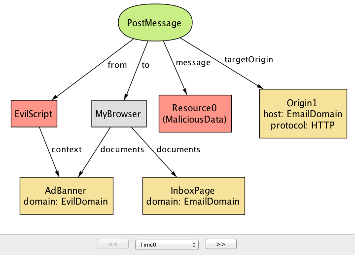

The browser then forwards this message to the document(s)
with the corresponding origin (in this case, `InboxPage`).  Unless
`InboxScript` specifically checks the value of `srcOrigin` to filter out
messages from unwanted origins, `InboxPage` will accept the malicious
data, possibly leading to further security attacks (for example, it
may embed a piece of JavaScript to carry out an XSS attack).

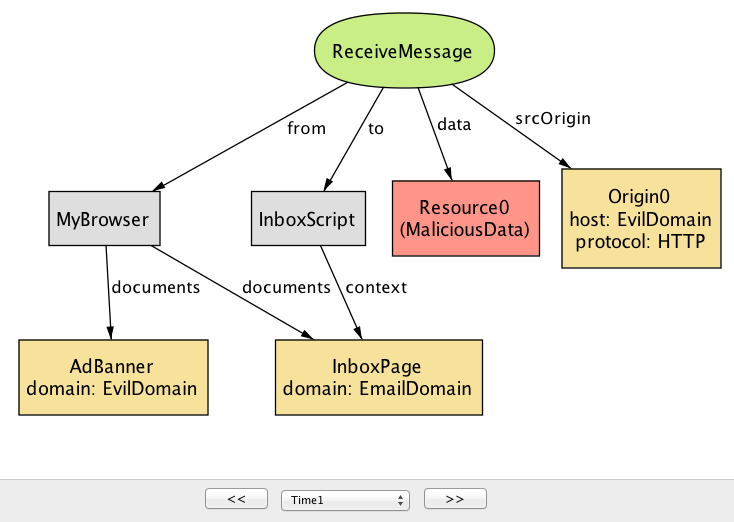

Implementing an appropriate check on incoming PostMessage can be tricky; in some applications, it is hard to determine in advance the list of trusted origins from which messages are expected to be received (in some apps, this list may even change dynamically). So the omission of the origin check may not be the result of simple incompetence.

### Cross-Origin Resource Sharing (CORS)

Cross-Origin Resource Sharing (CORS) is a mechanism designed to allow
a server to share its resources with sites from different origins. In
particular, CORS can be used by a script from one origin to make
requests to a server with a different origin, effectively bypassing
the restriction of the SOP on cross-origin Ajax requests. 

Briefly, a typical CORS process involves two steps: (1) a script
wanting to access a resource from a foreign server includes, in its
request, an "Origin" header that specifies the origin of the script,
and (2) the server includes an "Access-Control-Allow-Origin" header as
part of its response, indicating a set of origins that are allowed to
access the server's resource. Normally, without CORS, a browser would
prevent the script from making a cross-origin request in the first
place, conforming to the SOP. However, with CORS enabled, the browser
allows the script to send the request and access its response, but
_only if_ "Origin" is one of the origins specified in
"Access-Control-Allow-Origin".

(CORS additionally includes a notion of _preflight_ requests, not discussed here, to
support complex types of cross-origin requests besides GETs and POSTs.)

In Alloy, we model a CORS request as a special kind of
`XmlHttpRequest`, with two extra fields `origin` and `allowedOrigins`:

```alloy
sig CorsRequest in XmlHttpRequest {
  -- "origin" header in request from client
  origin: Origin,
  -- "access-control-allow-origin" header in response from server
  allowedOrigins: set Origin
}{
  from in Script
}
```

We then use an Alloy fact `corsRule` to describe what constitutes a valid CORS request:

```alloy
fact corsRule {
  all r: CorsRequest |
    -- the origin header of a CORS request matches the script context
    r.origin = origin[r.from.context.src] and
    -- the specified origin is one of the allowed origins
    r.origin in r.allowedOrigins
}
```

One common mistake that developers make with CORS is to use the
wildcard value "\*" as the value of "access-control-allow-origin"
header, allowing any site to access a resource on the server. This
access pattern is appropriate if the resource is considered public and
accessible to anyone; however, it turns out that many sites use "\*"
as the default value even for private resources, inadvertently
allowing malicious scripts to access them through CORS requests [cite
CORS study].

In our model, the wildcard value is represented by assigning to
`allowedOrigins` the set of all `Origin` objects:

```alloy 
some r: CorsRequest | r.allowedOrigins = Origin 
```

The developer of the calendar application decides to share some of its
resources with other applications by using the CORS
mechanism. Unfortunately, `CalendarServer` is configured to always
return "\*" as the value of the `access-control-allow-origin` header
in CORS responses, exposing sensitive information (`MySchedule`) to a
larger part of the web than the developer might have intended:

 

You may wonder why a developer would ever use the wildcard.
In practice, specifying the allowed origins can be tricky because it
may not be clear at design time which origins should be granted access
at runtime. A service may, for example, allow third party applications to
subscribe dynamically to its resources.

## Conclusion

In this chapter, we set out to construct a document that provides a
clear understanding of the SOP and its related mechanisms by building
a _model_ of the policy in a language called Alloy. Our model of the
SOP is not an implementation in the traditional sense, and can't be
deployed for use, unlike artifacts shown in other chapters. Instead, 
we wanted to demonstrate the key elements behind our approach to
``agile modeling'': (1) starting out with a small, abstract model of
the system and _incrementally_ adding details as necessary, (2)
specifying _properties_ that the system is expected to satisfy, and
(3) applying _rigorous analysis_ to explore potential flaws in the
design of the system. Of course, this chapter was written long after
the SOP was first introduced, but we believe that this type of
modeling would potentially be even more beneficial if it is done
during the early stage of system design.

Besides the SOP, Alloy has been used to model and reason about a
variety of systems across different domains -- ranging from network
protocols, semantic web, bytecode security to electronic voting and
medical systems. For many of these systems, Alloy's analysis led to
discovery of design flaws and bugs that had eluded the developers, in
some cases, for years. We invite our readers to visit the Alloy page
(http://alloy.mit.edu) and try building a model of their favorite
system!

## Appendix: Reusing Modules in Alloy 

As mentioned earlier in this chapter, Alloy makes no assumptions about
the behavior of the system being modeled. The lack of a built-in
paradigm allows the user to encode a wide range of modeling idioms
using a small core of the basic language constructs. We could, for
example, specify a system as a state machine, a data model with
complex invariants, a distributed event model with a global clock, or
whatever idiom is most suitable for the problem at hand. Commonly used
idioms can be captured as a generic module and reused across multiple
systems.

In our model of the SOP, we model the system as a set of endpoints
that communicate to each other by making one or more _calls_. Since
call is a fairly generic notion, we encapsulate its description in a
separate Alloy module, to be imported from other modules that rely on
it -- similar to standard libraries in programming languages:

```alloy 
module call[T] 
```

In this module declaration, `T` represents a type parameter that can be
instantiated to a concrete type that is provided when the module is
imported. We will soon see how this type parameter is used.

It is often convenient to describe the system execution as taking
place over a global time frame, so that we can talk about calls as
occurring before or after each other (or at the same time). To
represent the notion of time, we introduce a new signature called `Time`:

```alloy
open util/ordering[Time] as ord
sig Time {}
```
In Alloy, `util/ordering` is a built-in module that imposes a total
order on the type parameter, and so by importing `ordering[Time]`, we
obtain a set of `Time` objects that behave like other totally ordered
sets (e.g., natural numbers).

Note that there is absolutely nothing special about `Time`; we've
could named it any other way (for example, `Step` or `State`), and it
wouldn't have changed the behavior of the model at all. All we are
doing here is using an additional column in a relation as a way of
representing the content of a field at different points in a system
execution (for example, `cookies` in the `Browser` signature). In this
sense, `Time` objects are nothing but helper objects used as a kind of
indices.

Each call occurs between two points in time -- its `start` and `end`
times, and is associated with a sender (represented by `from`) and a
receiver (`to`):

```alloy 
abstract sig Call { start, end: Time, from, to: T } 
```

Recall that in our discussion of HTTP requests, we imported the module
`call` by passing `Endpoint` as its type parameter. As a result, the
parametric type `T` is instantiated to `Endpoint`, and we obtain a set
of `Call` objects that are associated to a pair of sender and receiver
endpoints. A module can be imported multiple times; for example, we
could declare a signature called `UnixProcess`, and instantiate the
module `call` to obtain a distinct set of `Call` objects that are sent
from one UNIX process to another.

